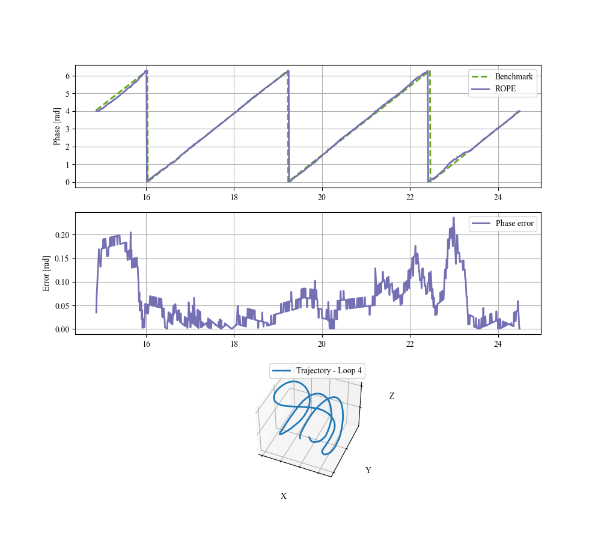

# Recursive Online Phase Estimator (ROPE)

**ROPE** is a Python algorithm designed for online phase estimation of quasi-periodic, multidimensional signals. It is particularly useful for signals such as 3D trajectories acquired via motion capture or wearable sensors. The algorithm estimates phase in real time and optionally aligns it to a reference cycle (baseline), making it suitable for comparative movement analysis.

---

## 📁 Project Structure

```
├── RecursiveOnlinePhaseEstimator.py      # Main algorithm
├── low_pass_filters.py                   # Low-pass filter definitions
├── wrap_functions.py                     # Utility functions for phase wrapping
├── process_signal_example.py             # Example usage script
├── example/
│   └── data                              # Example data
```

---

## ⚙️ Configuration for ROPE

Depending on the use case, ROPE can be run in one of two modes. Below are the required settings for each.

### 1. Untethered Mode

> Use this mode when estimating the phase of a single signal, without aligning it to a reference.

Required parameters:

- `is_use_baseline = False`
- `listening_time`: Time [s] to collect signal before estimating the first loop (should include ≥2 pseudo-periods)
- `discarded_time`: Time [s] to discard at the beginning
- `min_duration_first_pseudoperiod`: Minimum acceptable duration [s] of first pseudo-period
- `look_ahead_pcent`, `look_behind_pcent`: Percentages of the previous cycle to search around the matched point
- `time_const_lowpass_filter_phase`: Optional time constant [s] for low-pass filtering the phase (`None` to disable)
- `time_const_lowpass_filter_pos`: Optional time constant [s] for low-pass filtering position
- `is_use_elapsed_time`: If `True`, matches also based on elapsed time in the cycle (default `False`)

---

### 2. Tethered Mode

> Use this mode to align the estimated phase with a reference baseline cycle (useful for comparisons between signals).

Required additional parameters:

- `is_use_baseline = True`
- `baseline_pos_loop`: (N×D) array representing the full reference cycle
- `ref_frame_estimand_points`: List of points defining a reference frame for the estimand signal
- `ref_frame_baseline_points`: List of points defining a reference frame for the baseline
- `time_step_baseline`: Time step [s] between baseline samples

Ensure that:

- The estimand and baseline trajectories are expressed in their own local frames
- The reference cycle is clean and contains at least one complete pseudo-period

---

## 🚀 Running the Example

The file `example/process_signal_example.py` demonstrates how to use ROPE with recorded spiral 3D motion data.

```bash
python example/process_signal_example.py
```

The script will:

1. Load 3D position data and reference frames
2. Run ROPE to estimate the online phase
3. Optionally compare it with the benchmark (ground truth) phase
4. Plot:
   - Estimated vs benchmark phase
   - Estimation error
   - 3D trajectory of the estimated loop

---

## 📊 Example Output



---

## 📦 Requirements

Install required packages with:

```bash
pip install -r requirements.txt
```

---

## 📄 License

Distributed under the MIT License. Feel free to use, modify, and cite this repository.

---


If you use this code for research, please cite the related paper (available upon request).
